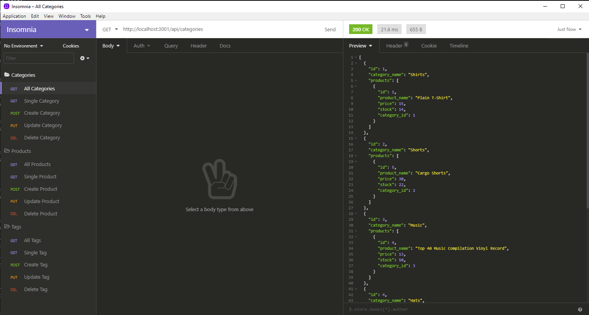

# ECOMMERCE

## TABLE OF CONTENTS
[1. DESCRIPTION](#DESCRIPTION)    
[2. INSTALLATION](#INSTALLATION)  
[3. DEPENDENCIES](#DEPENDENCIES)    
[4. USAGE](#USAGE)  
[5. CONTRIBUTING](#CONTRIBUTING)  
[6. TESTS](#TESTS)  
[7. LICENSE](#LICENSE)  
[8. DEMO VIDEO](#DEMO-VIDEO)  
[9. QUESTIONS](#QUESTIONS)  

---

## DESCRIPTION
A fully functioning backend for a ecommerce with seeded data.

---

## INSTALLATION
To run the tool you will need to clone the project files from my GitHub page at https://github.com/brandonljackson23/e-commerce. You will also need to install all dependencies, which are listed below.

---

## DEPENDENCIES
To run the tool you will need to install the following:
* mysql2
* express.js
* sequelize package
* dotenv package

---

## USAGE
The tool is intended to be used as a back end for a ecommerce site.

---

## CONTRIBUTING
Currently, Brandon Jackson is the sole contributor to this tool.  If you wish to contribute please contact Brandon Jackson at the email listed below.

---

## TESTS
There are currently no tests written for this application.

---

## LICENSE
This application is covered under the following license(s): None

---

## DEMO VIDEO
Click on the image below to watch a short demo video that illustrates how the tool works.

---

## QUESTIONS
If you have any questions please contact:  
|  Brandon Jackson  |  brandonljackson23@gmail.com  |  <https://github.com/brandonljackson23>  |
